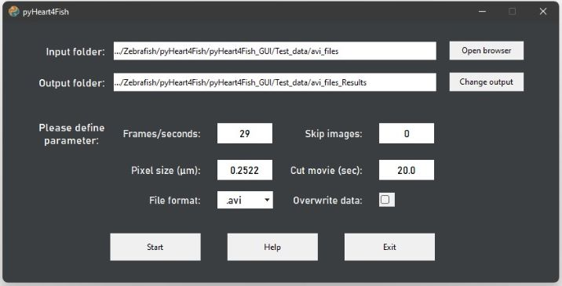
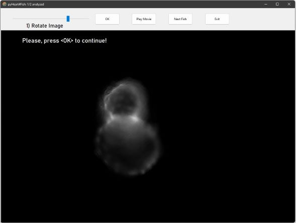
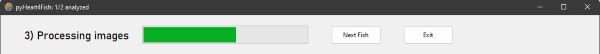
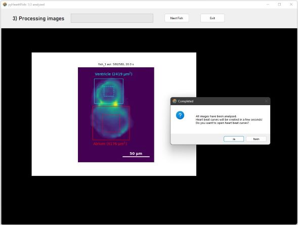
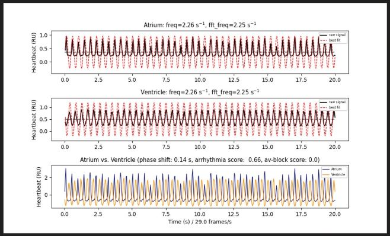
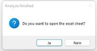
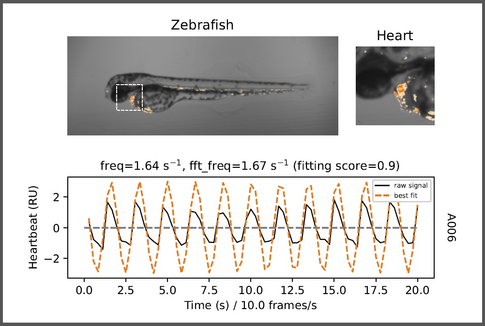

# pyHeart4Fish - A Heartbeat Analysis Tool for Zebrafish #

### Please cite the original paper: ###
V. Vedder and T. Reinberger et al. <br/>
"pyHeart4Fish: Chamber-specific heart phenotype quantification of zebrafish in high-content screens" <br/>
Front. Cell Dev. Biol. Sec. Molecular and Cellular Pathology , Volume 11 - 2023 | doi: 10.3389/fcell.2023.1143852

<!README file was written according to: 
https://medium.com/analytics-vidhya/how-to-create-a-readme-md-file-8fb2e8ce24e3>

---

---
## Content ##
1. How to install pyHeart4Fish
2. Tutorial - How to run pyHeart4Fish
3. Troubleshooting and FAQ
4. Licensing

---

---

## How to install pyHeart4Fish ##

The pyHeart4Fish has been developed and tested in **Windows 10 and 11**! <br/>
If not done yet [download](https://www.python.org/downloads/) 
and install python >3.7 on your computer, please! Check **ADD TO PATH** when asked.

## Installation ##

### Option 1: Download ```pyHeart4Fish_scripts``` folder ###
1. Download pyHeart4Fish_python folder from [GitHub/ToReinberger/pyHeart4Fish](https://github.com/ToReinberger/pyHeart4Fish)
2. Move the complete folder from ./downloads to a desired storage place <br/> 
   (e.g., C:\Users\<user_name>\Desktop\pyHeart4Fish_python)
3. Open command line in Windows (e.g., by typing ```cmd``` in Windows search field)
4. Move to the pyHeart4Fish folder by  typing ```cd C:\Users\<YOUR_USERNAME>\Desktop\pyHeart4Fish_scripts```
5. Install required packages by typing ```pip install -r requirements.txt``` <br/>
   or ```pip install -r requirements_for_installation.txt```

### Option 2: Download and run install ```install_pyHeart4Fish.py```  ###
1. Download ```install_pyHeart4Fish.py``` from [GitHub/ToReinberger/pyHeart4Fish](https://github.com/ToReinberger/pyHeart4Fish)
2. Start ```install_pyHeart4Fish.py``` > double click  OR right click > open with Python
3. Follow instructions


#### Required python packages: ####

* aicsimageio==4.7.0
* czifile==2019.7.2
* aicspylibczi==3.0.5
* matplotlib>=3.5.1
* numpy==1.21.2
* opencv_python==4.5.5.62
* pandas>=1.3.4
* Pillow>=9.2.0
* scipy==1.8.0
* openpyxl==3.0.10
  

#### bug fixes ####

16-07-2024
Installation issues 
1) aicsimageio or aicspylibczi needs Microsoft Visual C++ 14.0 or greater
2) install from [htt](https://visualstudio.microsoft.com/visual-cpp-build-tools/)

11-05-2023
1) CziReader from AICSImageIO has been fully replaced czifile package > now all image types can be loaded correctly 
2) pxiel values of images are now normalied [0 - 255] using cv2.normalize method
3) .feather output per fish was replaced with .csv, as .feather cannot store single line outputs

---

---

## Tutorial - How to run pyHeart4Fish ##

### Step 1) Run heart_beat_GUI.py script ###

1. If a Desktop shortcut has been created, double-click the ```pyHeart4Fish``` icon  (**Installation option 2**)
2. OR right click on ```pyHeart4Fish_scripts/heart_beat_GUI.py``` > open with python (**Installation option 1**)
3. OR in Windows console ``` python <YOUR_STORAGE_PATH>/pyHeart4Fish_scripts/heart_beat_GUI.py``` (**Installation option 2**)
4. OR start ```heart_beat_GUI.py``` in a Python IDE of your choice (e.g., Pycharm, KITE, Notepad++)
5. OR double-click on ```pyHeart4Fish_exe/heart_beat_GUI.exe``` (**Installation option 3**)

This Python script opens the main window of pyHeart4Fish (see **Step 2**)

#### Input data types: ####

**Please check experimental requirements before using pyHeart4Fish:**

- [ ] Only **one zebrafish heart** should be imaged at once!
- [ ] The optimal acquisition time is between 15 s and 30 s!
- [ ] Make sure that the acquisition time is a bit longer as desired (e.g., 22 s)
- [ ] Use a frame rate higher than 15 f/s to increase analysis quality for arrhythmias

<br/>
Accepted file formats:

* .avi
* .czi (ZEISS file format)
* .mp4
* .tif-files, .png-files or .jpg-files 
as a series of frames stored in one folder per fish

#### Output data files stored in the results folder: ####
* Config-file as json-file
* Raw data of heartbeats as numpy array
* Atrium and ventricle curves and fitted sine functions as plot
* Processed heart images as GIF-file (10 iterations)
* Excel sheet for each fish in subfolder with all parameters
* Combined Excel sheet for all zebrafish analyzed

#### Test data sets in >Test_data< folder ####

Test data can be found on [OneDrive](https://1drv.ms/u/s!AufmqdD8moMXgc5_OE-MnNHlOM-bcQ?e=yPcRcx). <br/>
Please <b>unzip</b> data sets before analysis!

* **fish_1_2_avi_files.zip** and avi_files_Results_example
  * Frames per seconds = 29 and cut movie at = 20 sec
* **fish_1_2_czi_files.zip** and czi-files_Results_example
  * Frames per seconds = 9.5 and cut movie at = 20 sec
* **fish_1_2_tif_files** and tif_files_Results_example 
  * Frames per seconds = 29 and cut movie at = 20 sec
    

### Step 2) Select input and output folder and set configurations ###




<table border="1">
  <tr>
    <td><b>Input folder</b>:</td>
    <td> > Contains all movie-files/ images in sub-folders for one project/ experiment <br/>
         > Choose file folder and click <b> Open Folder </b> 
    </td>
   </tr>
  <tr>
     <td><b>Output folder</b>: </td>
     <td>
        > Is automatically created : Input + "_Results" <br/> 
        > Or click <b> Change output </b>  to define a desired output folder <br/>
        > Contains all configuration files, raw data, plots and excel sheets (see above) 
     </td>
  </tr>
  <tr>
    <td><b> Frames per second: </b> </td>
    <td> > Should be > 15 for optimal results for optimal results, <br/>
          but 10 f/s can be sufficient </td>
  </tr>
  <tr>
     <td> <b> Skip images: </b> </td>
     <td> > Default 0, (0 - 10 possible) <br/>
          > 1 = Every second frame is skipped  <br/>
          > Might accelerate the analysis as the number of images is cut in half <br/>
          > Use only if frame rate is high enough! 
          </td>
  </tr>
  <tr>
     <td> <b> Pixel size: </b> </td>
     <td> > Please check the size of a pixel at your microscope; <br/>
            in your metadata; or use a scale and ImageJ/Fiji to determine your pixel size [µm] <br/>
          > A wrong pixel size will give wrong heart size etc.  <br/>
          > Relative values will still apply  <br/>
          </td>
  </tr> 
  <tr>
     <td> <b> Cut movie (sec): </b> </td>
     <td> > The length of the movie should be at least 10 s <br/>
          > Ensures that all movies have the same length  <br/>
          </td>
  </tr>
  <tr>
     <td> <b> File format: </b> </td>
     <td> > See <b> Input data types </b>
          </td>
  </tr>
  <tr>
     <td> <b> Overwrite data: </b> </td>
     <td> > If data needs to be re-analyzed <br/>
          > If unselected all analyzed hearts will be skipped in the project folder
          </td>
  </tr>

  <tr>
     <td> <b> Acquisition mode: </b> </td>
     <td> > Fluorescence (chamber-specific): Fluorescent heart is required <br/>
            and 10x magnification is desired  <br/>
          > Bright field (only heartbeat): The script is optimized for bright field movies /series <br/> 
            of frames of whole zebrafish in sagittal position (eyes included)
          </td>
  </tr>
    
</table>


#### Start program ####

By clicking ```Start```, the method ```StartConfigs.run_program``` is executed which iteratively <br/>
executes ```heart_beat_GUI_only_one_fish_multiprocessing.py``` <br/> 
or ```heart_beat_GUI_only_one_fish_multiprocessing.py``` <br/>  
for each zebrafish and combines all Excel sheets once all zebrafish have been analyzed. <br/>  
In the bright field acquisition mode, all zebrafish will be analyzed automatically. <br/> 
This will take a while, e.g., 20 to 30 min for 40 zebrafish depending on the computer performance.  
<br/>


### Step 3) Rotate heart for fluorescent acquisition mode ###

Rotate the heart for chamber-specific fluorescent acquisition mode using the slider to position ventricle   <br/>
at the top and atrium at the bottom. Click ```OK``` to continue. <br/> 
You can orientate the fish in another direction.  <br/> 
However, the tool will later automatically re-rotate the video for analysis!



### Step 4) Define atrium and ventricle ###

To distinguish between background and heart define 1) atrium and 2) ventricle area by ```Drag-and-Draw```.
Click ```OK``` to start the analysis of all frames / images. <br/>
Best results yields a rough selection around respective heart chambers (see image below).
<br/> Make sure that the border encloses all parts of the atrium!


The first processed image is shown after the complete analysis.
Press  ```Yes``` to show heartbeat curves. <br/>

The number of analyzed fish hearts is shown in the top left corner (here: 1/2 analyzed)






### Heartbeat curves ###



<table border="1">
  <tr>
    <td><b>freq: </b></td>
    <td> > Frequency / rate of heartbeats derived from fitted sine function (red dotted line) </td>
   </tr>
  <tr>
     <td><b>fft_freq: </b> </td>
     <td>
        > Frequency / rate of heartbeats derived from fast fourier transformation (FFT) <br/>
     </td>
  </tr>
  <tr>
    <td><b> phase shift: </b> </td>
    <td> > Shift between atrium and ventricle sine function <br/>
         > A very small or very high phase shift can be a sign of arrhythmia / AV-block
            but 10 f/s can be sufficient </td>
  </tr>
  <tr>
     <td> <b> arrhythmia score: </b> </td>
     <td> > The lower this value, the more regular the heartbeat. <br/> 
          > A value >0.7 is a sign of arrhythmia <br/>
          </td>
  </tr>
  <tr>
     <td> <b> av-block score: </b> </td>
     <td> > The absolute difference of all frequencies (freq and fft_freq) between atrium and ventricle <br/>
          > A value >0.5 is a sign for a conduction defect or atrial/ ventricle tachycardia or bradycardia
          </td>
  </tr> 
  
</table>


### Excel sheet for all heart movies analyzed ###

Once all fish hearts have been analyzed you can choose to open the summary Excel sheet for all fish



<b> Output parameters: </b> 

<table border="1">
  <tr>
    <td><b> Project_name </b></td>
    <td> > Name of the project folder </td>
   </tr>
  <tr>
     <td><b> Condition </b> </td>
     <td>
        > File name of of movie / image folder <br/>
     </td>
  </tr>
  <tr>
    <td><b> Number_images </b> </td>
    <td> > Number of images/ frames analyzed <br/>
    </td>
  </tr>
  <tr>
     <td> <b> Heart_size (µm^2) </b> </td>
     <td> > Size of the heart (atrium + ventricle) </td>
  </tr>
  <tr>
     <td> <b> x_distance (µm) </b> </td>
     <td> > Maximal horizontal distance </td>
  </tr> 
   <tr>
     <td> <b> y_distance (µm) </b> </td>
     <td> > Maximal vertical distance </td>
  </tr>
   <tr>
     <td> <b> Round_shape </b> </td>
     <td> > Derived from x_distance-y_distance ratio (1 = round, 0 = stretched) </td>
  </tr>
  <tr>
     <td> <b> Atrium/ ventricle maximal dilated or maximal contracted chamber area </b> </td>
     <td> > Minimal area = contraction; maximal area = dilatation </td>
  </tr> 
  <tr>
     <td> <b> Atrium/ ventricle relative contractility (%)  </b> </td>
     <td> > Maximal difference in area normalized to maximal chamber area
     </td>
  </tr>
  <tr>
     <td> <b> Atrium/ ventricle ejection fraction (µm^3)  </b> </td>
     <td> > Absolute change in volume (cylinder approximation)
     </td>
  </tr>
  <tr>
     <td> <b> Atrium/ ventricle ejection fraction (µm^3)  </b> </td>
     <td> > Absolute change in volume (cylinder approximation)
     </td>
  </tr>
   <tr>
     <td> <b> Atrium/ ventricle fit_score  </b> </td>
     <td> > Correlation coefficient between raw data and fitted curve (red line)
     </td>
  </tr>
    <tr>
     <td> <b> Atrium/ ventricle Auto_Corr  </b> </td>
     <td> > Auto-Correlation coefficient for raw data <br/>
          > The higher the value, the more regular the heartbeat
     </td>
  </tr> 
   <tr>
     <td> <b> Freq, Freq_fft, phase_shift, arrhythmia score, av_block_score  </b> </td>
     <td> > see above
     </td>
  </tr> 

</table>

<br/>

### Heartbeat curve for bright field ###




---
## Troubleshooting and FAQ ##

### Installation issues ###
* If ```install_pyHeart4Fish.py``` does not run to the end or the desktop icon is missing, <br/>
install the package ```pyshortcuts``` first by typing ```pip install pyshortcuts``` in Windows console <br/>
and run again ```install_pyHeart4Fish.py```
* You might also install all packages in ```requirements.txt``` separately from 
(see [GitHub/ToReinberger/pyHeart4Fish](https://github.com/ToReinberger/pyHeart4Fish)  
by typing ```pip install <NAME_OF_PACKAGE>``` in Windows console


### Analysis error ###
* Make sure that the background fluorescence is as low as possible  
* In step 3 and 4, make sure you correctly select the atrium (in most case less bright part of the fish),<br/>
otherwise the background threshold is set incorrectly 
* If the heart hasn't been identified correctly, please try to re-define atrium and ventricle area, 
e.g., by enlarging the area
* If progress bar is on hold, please click ```Next Fish``` as an error has occurred

> **Please contact tobias.reinberger@uni-luebeck.de to report any issues**


---
## Licensing ##

BSD 2-Clause License

Copyright (c) 2022, Tobias Reinberger and Viviana Vedder. All rights reserved.

Cite as V. Vedder and T. Reinberger et al., pyHeart4Fish: Chamber-specific heart phenotype quantification of zebrafish in high-content screens,
Front. Cell Dev. Biol. Sec. Molecular and Cellular Pathology , Volume 11 - 2023 | doi: 10.3389/fcell.2023.1143852

Redistribution and use in source and binary forms, with or without modification, are permitted provided that the following conditions are met:

1. Redistributions of source code must retain the above copyright notice, this list of conditions and the following disclaimer.
2. Redistributions in binary form must reproduce the above copyright notice, this list of conditions and the following disclaimer in the documentation and/or other materials provided with the distribution.

THIS SOFTWARE IS PROVIDED BY THE COPYRIGHT HOLDERS AND CONTRIBUTORS "AS IS" AND ANY EXPRESS OR IMPLIED WARRANTIES, INCLUDING, BUT NOT LIMITED TO, THE IMPLIED WARRANTIES OF MERCHANTABILITY AND FITNESS FOR A PARTICULAR PURPOSE ARE DISCLAIMED. IN NO EVENT SHALL THE COPYRIGHT HOLDER OR CONTRIBUTORS BE LIABLE FOR ANY DIRECT, INDIRECT, INCIDENTAL, SPECIAL, EXEMPLARY, OR CONSEQUENTIAL DAMAGES (INCLUDING, BUT NOT LIMITED TO, PROCUREMENT OF SUBSTITUTE GOODS OR SERVICES; LOSS OF USE, DATA, OR PROFITS; OR BUSINESS INTERRUPTION) HOWEVER CAUSED AND ON ANY THEORY OF LIABILITY, WHETHER IN CONTRACT, STRICT LIABILITY, OR TORT (INCLUDING NEGLIGENCE OR OTHERWISE) ARISING IN ANY WAY OUT OF THE USE OF THIS SOFTWARE, EVEN IF ADVISED OF THE POSSIBILITY OF SUCH DAMAGE.

---
